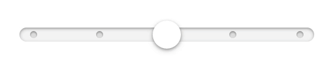

## Meadow Slider

Clean and simple Slider component. For when `<input type="range" />` just won't do (IE9).



[See it in action](https://meadowplatform.com/)

-----

### Installation

This component is designed for use with Browserify (but should work with anything CommonJS compatible). You can easily install it with npm:

```
npm install @meadow/react-slider
```

-----

### Usage

Meadow Slider is a drop-in replacement for `<input type="range" />` with a couple extras here and there. Basic usage looks something like this:

```jsx
var Slider = require('@meadow/react-slider');

var App = React.createClass({
  render: function () {
    return (
      <div>
        <Slider min={5} max={150} />
      </div>
    )
  }
})
```

##### Styles

In order for this component to work, you **must** also include some styles. The easiest way to do so is by including the compiled CSS directly from this module:

```styl
import 'node_modules/@meadow/react-slider/lib/styles/Slider.css';
```

-----

### Props

Property | Type | Description
----- | ----- | -----
**min** | *Number* | The minimum value of the slider.
**max** | *Number* | The maximum value of the slider.
**step** | *Number* | If set, this splits the slider into a set of steps that are `step` apart.
**value** | *Number* | The value of the slider. If set, the slider will be a controlled component. You will need to set the `onChange` handler and update `value` manually.
**defaultValue** | *Number* | The intial value of the slider. If set, the slider will be an uncontrolled component.
**onChange** | *Function* | Callback to be fired when the value of the slider changes. Takes a single argument, `newValue`.
**className** | *String* | The CSS classes to be applied to the base slider element.
